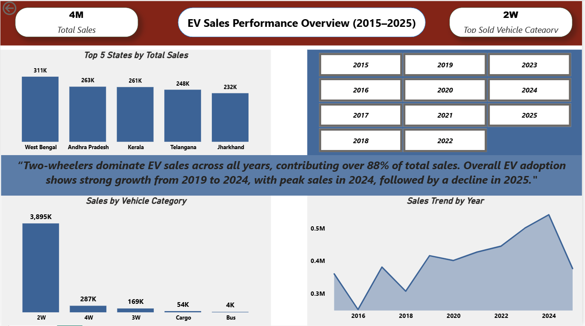

# EV Sales Performance Overview (2015–2025)

##  Project Overview
This project presents an end-to-end analysis of Electric Vehicle (EV) sales data from 2015 to 2025.  
It demonstrates a complete data analytics pipeline covering data ingestion, cleaning, transformation, analysis, reporting, and visualization using industry-relevant tools.

The goal of the project is to derive meaningful business insights related to EV adoption trends, vehicle category performance, and regional sales distribution.

---

##  Data Pipeline & Workflow
The project follows a structured analytics workflow:

Raw Data (CSV)  
→ Python ETL (Cleaning & Transformation)  
→ MySQL (SQL Analysis)  
→ Excel (Reporting)  
→ Power BI (Interactive Dashboard)

---

## ⚙️ Data Pipeline & Automation
A Python-based ETL pipeline was developed to automate data cleaning and loading processes.

### Key ETL Features
- Column standardization and data type validation  
- Duplicate record removal and null value handling  
- Data normalization and formatting  
- Full refresh load into MySQL database  
- Export of cleaned data for Excel and Power BI analysis  
- Reusable pipeline design suitable for scheduled execution  

---

## 🗄️ SQL Analysis
SQL was used to perform structured analysis on the cleaned EV sales data stored in MySQL.

### Key SQL Analyses
- Total and year-wise EV sales aggregation  
- Vehicle category-wise sales comparison  
- State-wise sales performance analysis  
- Identification of top-performing categories and regions  

---

## 📊 Excel Reporting
Microsoft Excel was used for initial exploratory analysis and reporting.

### Excel Highlights
- Pivot tables for category and state-level summaries  
- KPI calculations for total and average sales  
- Basic charts to validate trends before dashboarding  

---

## 📈 Power BI Dashboard
Power BI was used as the final visualization layer to present insights in a clean, interactive, and business-focused dashboard.

### Dashboard Highlights
- Total EV sales overview (2015–2025)  
- Top-selling vehicle category identification  
- Top 5 states by total EV sales  
- Vehicle category-wise sales comparison  
- Year-wise EV sales trend analysis  
- Interactive year slicer for dynamic filtering  

### Key Insight
> **Two-wheelers dominate EV sales across all years, contributing over 88% of total sales. Overall EV adoption shows strong growth from 2019 to 2024, with peak sales in 2024, followed by a decline in 2025 (likely due to partial-year data).**

---

## 🛠 Tools & Technologies
- Python (Pandas, NumPy)  
- MySQL  
- Microsoft Excel  
- Power BI  
- DAX  

